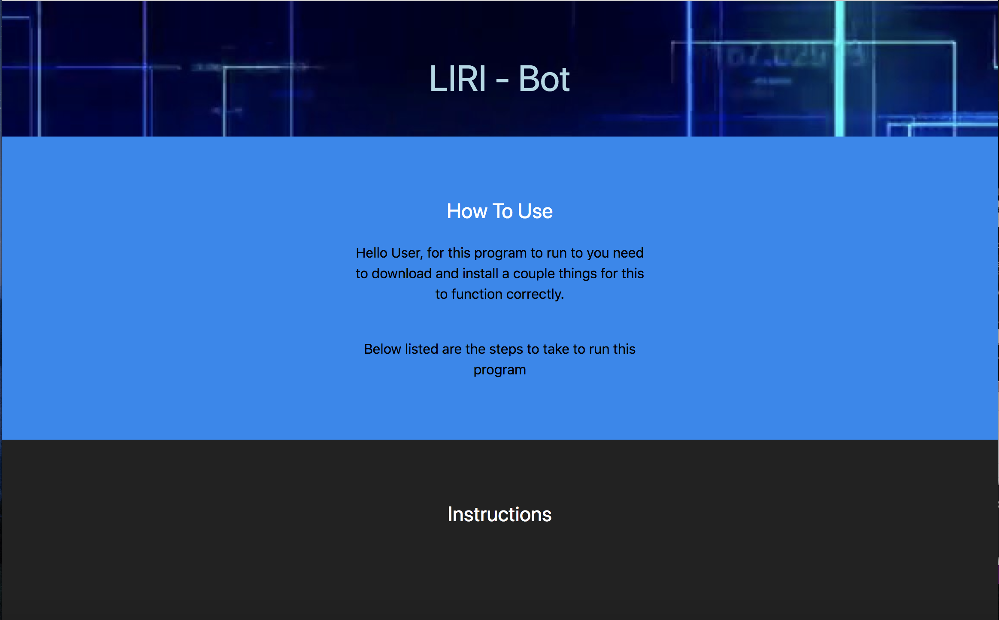
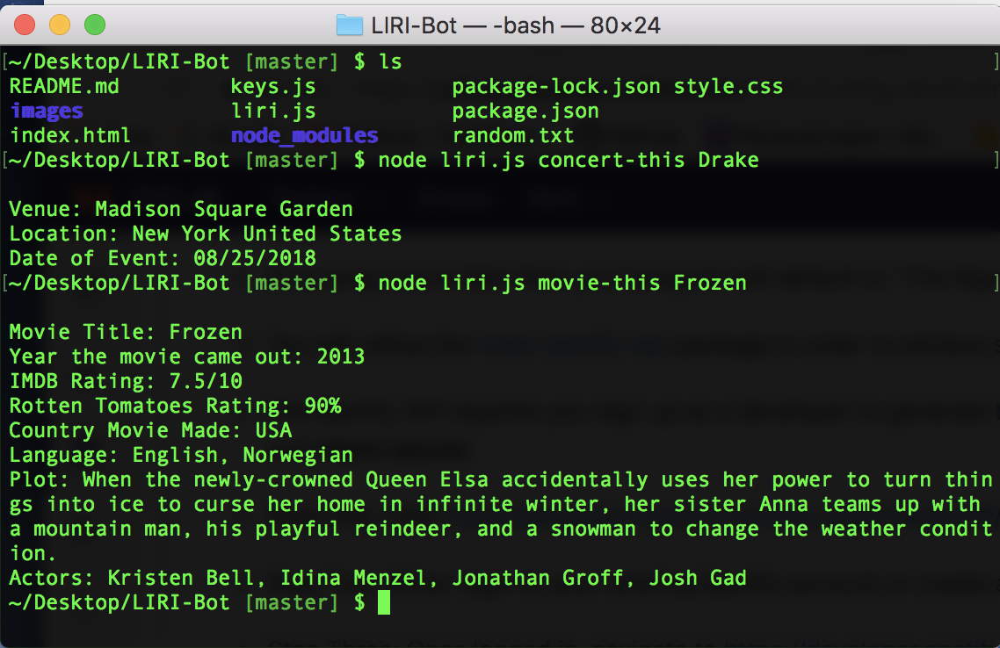

# LIRI-Bot

This program uses Node.js to run with request from different API's while using a Javascript file to perform most of the work. This program can only work on Terminal with instruction provided in the main link on how to download and use Node.js. 

[LIRI-Bot](https://mawais54013.github.io/LIRI-Bot/)

[Portfolio](https://mawais54013.github.io/Bootstrap-Portfolio/portfolio.html)

# Images


This the website I created using UIkit to explain how the application works along with instructions to install programs and navigation to Terminal to run the program. 


This is an example of what the program returns when the user types in 'concert-this' and the artist name. It also shows movie details when the user types in 'movie-this' and name of movie.

# Technology Used 
- Javascript
- Node.js
- HTML
- CSS
- Terminal
- UIKit
- Text
- JSON
- NPM

# Code Snippets
1) This code was challenging because Spotify has several ways to obtain information and return it. But in many cases the return values were either object Object or required a token to proceed. So the following code creates a new Spotify search that looks for the song the user typed in. Then from the data returns objects that are either the song or similar other songs. I selected the first one for this case but you can certainly loop to print out various songs of the same title. Some of the songs did not have a preview link so I added a if statement so that if the track had a link it would display it but otherwise it would include a album link and tells the user. 
```
spotify.search({type:'track', query: songs}, function(error, data)
{
    console.log(" ");
    console.log("Artist(s): " + data.tracks.items[0].album.artists[0].name);
    console.log("Song Name: " + data.tracks.items[0].name);
    if(data.tracks.items[0].preview_url === null)
    {
        console.log("No Preview Link but heres the album link: " + data.tracks.items[0].external_urls.spotify)
    }
    else 
    {
        console.log("Preview link: " + data.tracks.items[0].preview_url)
    }
    console.log("Name of album: " + data.tracks.items[0].album.name);
})
```
2) The next code read a text file in the folder that contains no codes and just play text, in this case: spotify-this-song,"I Want it That Way". This function reads the file without changing it and uses the data to perform the Spotify function as seen in the code above. The tricky part of this was the song name is in quotes, so it would return an error because the query does not accept anything with quotes. To solve this I used a split the text file into an array to select from. Then I used 'replace' to get rid of the quotes, after that I added a loop to add a '+' sign everytime there is a empty space. Then lastly I ran this function to the spotify code. 
```
fs.readFile("random.txt", "utf8", function(error, data)
{
    if(error)
    {
        console.log(error);
    }
    var whole = data.split(',');
    var x = whole[0];
    var y = whole[1];
    var z = y.replace(/\"/g, "");
    for(var i=0;i<z.length;i++)
    {
            z = z.replace(" ", "+")
    }
    song2 = z;
    // var t = z.split(' ').join('+');
    // console.log(t);
}
```

# Author 
[Muhammad Awais](https://github.com/mawais54013/Bootstrap-Portfolio)
